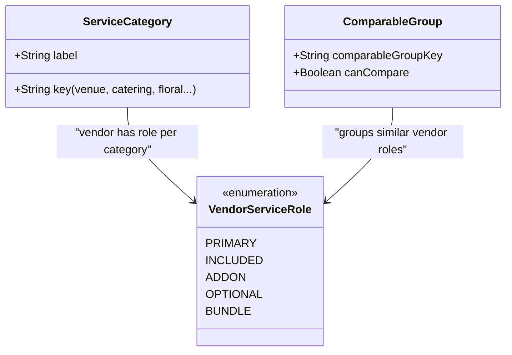

# AGY Fullstack / Domain Stabilization Status Report

> [!IMPORTANT]
> 본 문서는 **Codex Token Unavailable** 상황에 대응하여, **Antigravity (AGY)**가 임시로 yeON 프로젝트의 Full-stack Domain Architecture 및 Senior Product Engineer 역할을 위임받아 수행할 때 기준이 되는 authoritative status 문서입니다.

---

## 1. AGY Full-stack 역할 & Fallback 정책

* **임시 역할 위임**: Codex 서비스 토큰이 한시적으로 만료/제한됨에 따라, AGY가 Domain Contract 수립, 백엔드 로직 정교화, 데이터베이스 안정화, 그리고 API DTO 규정 작업을 통합 수행합니다.
* **Codex Unavailable Fallback 정책**:
  * 스키마 변경이 과도한 리스크를 지니는 경우, 백엔드 비즈니스 레이어(`app/actions/*`) 및 공용 비즈니스 DTO를 활용하여 도메인 모델을 일치시키는 **Option A(최소 구현 우선)**를 최우선 지향합니다.
  * 데이터 무결성을 훼손하는 어떠한 임시방편(Heuristic)도 허용하지 않으며, 백엔드의 확실한 Domain Contract에 기초하여 프론트엔드가 데이터를 수동적으로 소비하게 강제합니다.

---

## 2. 절대 금지 사항 & Audit-First 원칙

### 절대 금지 사항 (Strictly Forbidden)
* **Heuristic Heuristics 금지**: 프론트엔드 UI 컴포넌트 내부에서 `vendor.name`, `vendor.category`, `selectedModules[0]` 등의 문자열을 마구 조합해 도메인 의미나 카테고리를 자체 해석/추론하는 기법을 완전히 박멸합니다.
* **신규 브랜치 및 Push 금지**: 현재 브랜치 `codex/step3-main-logic-rewrite`에서만 작업하며, 외부 원격지로 `git push`하지 않습니다.
* **빌드 임시 파일 커밋 금지**: `tsconfig.tsbuildinfo` 등 컴파일 부산물 파일을 커밋에 포함시키지 않습니다.
* **docs/Claude_STATUS.md 보존**: 해당 프론트엔드 레거시 상태 문서는 수정하지 않고 순수 보존합니다.

### Audit-First 원칙
* 단 한 줄의 스키마나 비즈니스 액션 코드를 고치기 전에, 반드시 현재 스키마가 표현하는 도메인의 꼬임 현상과 위험 요소를 완벽히 추적해 **Audit Report**를 기재하고 승인받아야 합니다.

---

## 3. 이번 작업의 핵심 도메인 문제

현재 yeON 서비스는 Wedding/Funeral이라는 두 거대한 의례 도메인을 다루면서 다음과 같은 핵심 모델 문제를 겪고 있습니다:
1. **역할 정의의 모호함**: 예식장 벤더("모먼트 가든")는 대관뿐 아니라 식사(Catering), 꽃장식(Floral)을 묶어 기본 **Package**로 제공하는 반면, 전문 플로리스트("오르세 플로럴")는 예식장 기본 장식과 경쟁하는 관계가 아니라 추가 업그레이드 **Addon** 성격을 지닙니다.
2. **잘못된 비교 로직**: 위 두 벤더가 Wedding이라는 대분류 카테고리(또는 `selectedModules[0]`의 category)에 의해 동일 선상에서 1:1로 비교되는 현상이 발생하여, 꽃집과 예식장을 직접 비교하는 비상식적인 UI가 그려지고 있었습니다.
3. **도메인 Heuristics**: Step 4 대시보드 및 Step 3 모듈 빌더가 도메인에 대한 기준값 없이 프론트엔드에서 하드코딩된 규칙과 vendor category 컬럼의 첫 번째 값 등으로 카테고리 진행 상태를 억지로 끼워 맞춰 계산해 왔습니다.

---

## 4. 핵심 Stabilized 도메인 개념

우리는 이 문제를 해결하기 위해 백엔드 레이어에서 아래 개념을 온전히 정립하여 DTO로 내려줍니다:



* **ServiceCategory / PreparationCategory**:
  * **Wedding**: `venue` (예식장/공간), `catering` (식음료), `floral` (플라워/장식), `invitation` (초대장), `etc` (기타)
  * **Funeral**: `funeralHall` (장례식장), `meal` (문상객 식사), `obituary` (부고 안내), `hearse` (운구/장례절차), `altarFloral` (제단꽃/화환)
* **VendorServiceRole**: 벤더가 제공하는 카테고리의 공급적 성격을 명시합니다. (`PRIMARY`, `INCLUDED`, `ADDON`, `OPTIONAL`, `BUNDLE`)
* **Package / Bundle**: 벤더가 기본적으로 묶어서 구성해둔 상품 조합을 의미합니다.
* **ComparableGroup**: *동일 목적* 및 *동일 유형*의 견적 패키지끼리만 비교표를 제공하도록 제어합니다.
  * Moment Garden $\rightarrow$ `wedding_venue_package`
  * Orsay Floral $\rightarrow$ `wedding_floral_upgrade`
  * 두 업체의 `comparableGroupKey`가 서로 다르므로 Step 4에서 **결코 섞이지 않으며, 각각 단일 제안 카드로 수려하게 노출**됩니다.

---

## 5. 다른 에이전트 인계 시 필독 대상 파일

백엔드 도메인 및 DTO 구조를 파악하거나 수정하기 위해 차기 에이전트가 반드시 읽어야 하는 파일 목록입니다:

* **Authoritative Docs**:
  * [Codex_STATUS.md](file:///home/daniel/yeon/docs/Codex_STATUS.md) (최종 도메인/백엔드 아키텍처 공식 백서)
  * [AGY_FULLSTACK_STATUS.md](file:///home/daniel/yeon/docs/AGY_FULLSTACK_STATUS.md) (본 문서 - 임시 AGY stabilization 지침)
  * [claude_agy_STATUS.md](file:///home/daniel/yeon/docs/claude_agy_STATUS.md) (프론트엔드 화면 바인딩 handoff 문서)
* **Domain & Database**:
  * [schema.prisma](file:///home/daniel/yeon/prisma/schema.prisma)
  * [seed.ts](file:///home/daniel/yeon/prisma/seed.ts)
* **Backend Actions & Contracts**:
  * [app/actions/quote.ts](file:///home/daniel/yeon/app/actions/quote.ts)
  * [app/actions/reservation.ts](file:///home/daniel/yeon/app/actions/reservation.ts)
  * [lib/step3.shared.ts](file:///home/daniel/yeon/lib/step3.shared.ts)
  * [types/quote.ts](file:///home/daniel/yeon/types/quote.ts)
* **Frontend View Consumer**:
  * [modular-quote-builder.tsx](file:///home/daniel/yeon/components/features/planning/modular-quote-builder.tsx)
  * [step4-booking-dashboard.tsx](file:///home/daniel/yeon/components/features/planning/step4-booking-dashboard.tsx)

---

## 6. 검증 명령 목록

도메인 및 데이터 정합성 검증을 위해 반드시 순서대로 실행해야 하는 검증 명령어 리스트입니다:

```bash
# 1. Prisma 클라이언트 생성 및 DB 시딩
npx prisma generate
npm run db:seed

# 2. yeON 데이터 정합성 & 견적 워크플로우 비즈니스 정밀 검증
npx tsx scripts/verify-demo-data-integrity.ts
npx tsx scripts/verify-quote-flow.ts

# 3. 런칭 준비 스모크 테스트 및 동시성 락 스모크 검증
npx tsx scripts/launch-readiness-smoke.ts
npx tsx scripts/server-action-read-concurrency-smoke.ts

# 4. 권한 리다이렉트 기능 검증
npx tsx scripts/verify-planner-auth-redirect.ts

# 5. 정적 타입 컴파일 및 린트, 최종 빌드
npx tsc --noEmit
npm run lint
npm run build

# 6. 마이그레이션 적용 상태 검증
npx prisma migrate status
```
